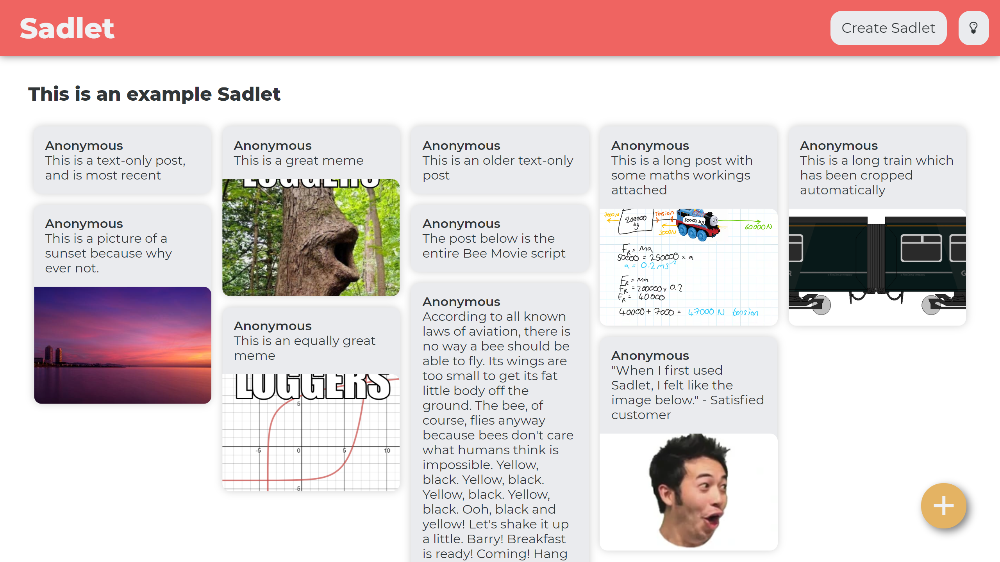
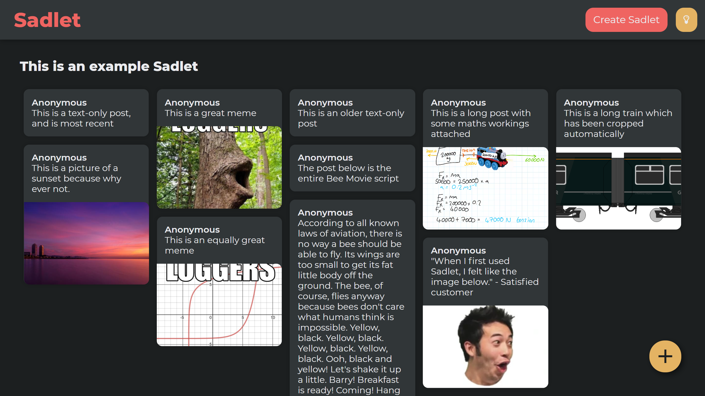
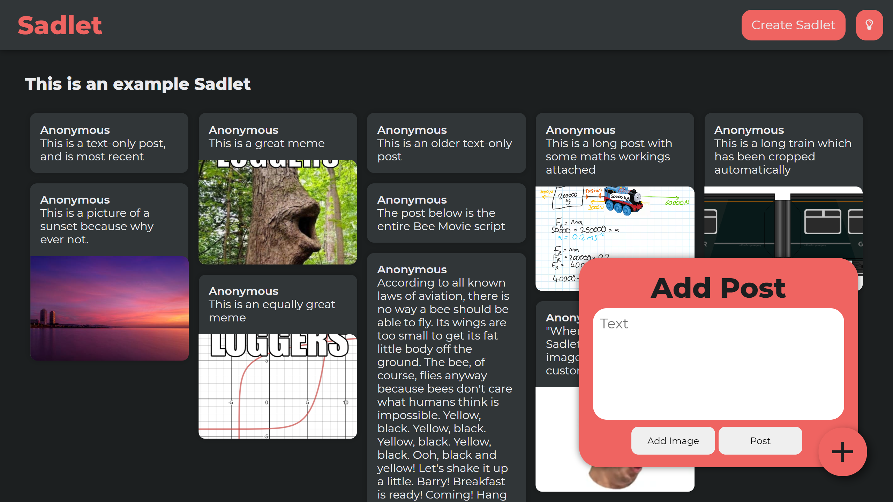
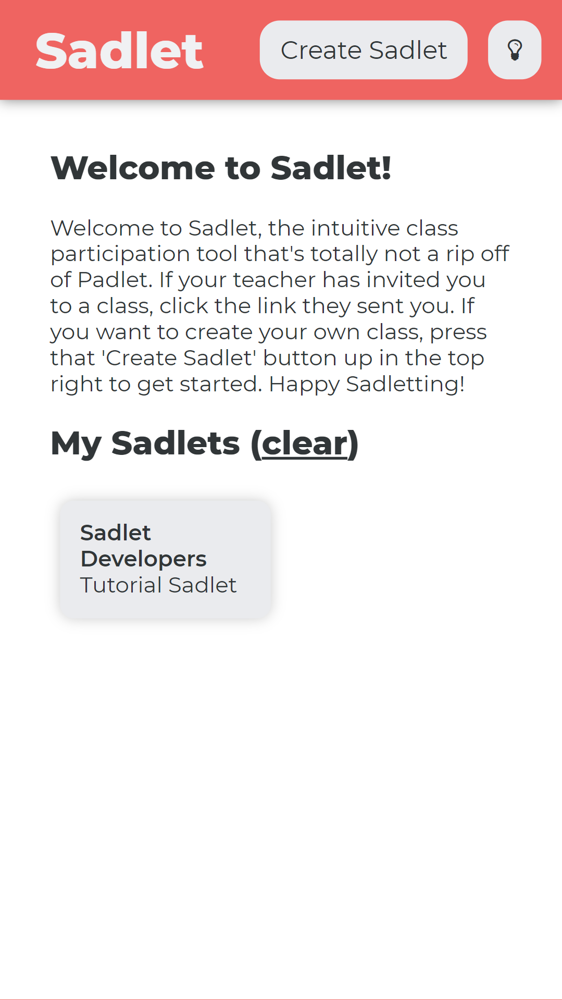
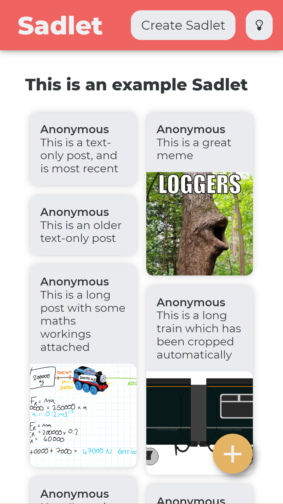
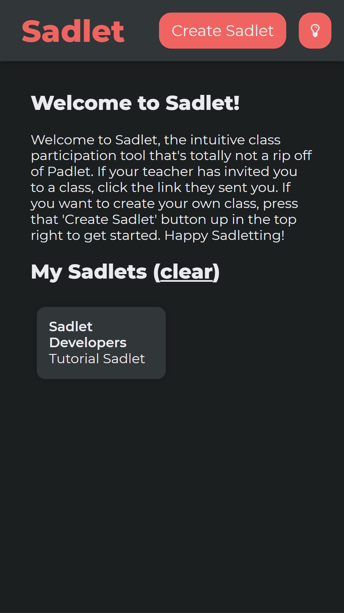
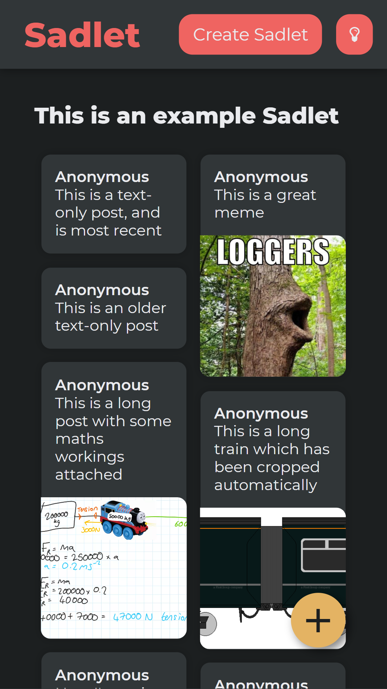

# Sadlet
Sadlet is an intuitive class participation tool that's totally not a rip-off of Padlet. Featuring anonymous sharing of messages and images between the class members, Sadlet allows any teacher to get a feel for the class's understanding of a topic without the need to put people on the spot by asking directly.

## How to use Sadlet

### Create a Sadlet
To create a Sadlet, press the "Create Sadlet" button in the top right, enter in a name for your Sadlet, and press the tick icon. You'll be redirected to your newly-created Sadlet, and it will be saved to "My Sadlets" on the homepage. However, if you clear your local storage, the "My Sadlets" section will be cleared too, so make sure you write down the URL.
### Make a post
If you're on an editable Sadlet, there will be a big yellow plus icon in the bottom right. To create a post, press that button, enter your post text and/or upload an image, then press "Post". You'll see a loading icon for a second or two, and if your post was successfully uploaded, it will turn into a tick, and the post will be visible to everyone on the Sadlet immediately.
### Enlarge an image
To enlarge an image, simply press on it, and it'll pop up fullscreen. To shrink it again, press anywhere on the screen.
### Use dark mode
To use the vastly-superior dark mode, press the light icon in the top right. To turn it off again, press the same button.
### Install on your phone
To install Sadlet as a PWA on your phone, just use your phone to navigate to wherever you're hosting it, and if it's served over HTTPS, you'll see an "Add to Home Screen" popup at the bottom of your screen. If this does not appear, you'll need to manually add it to your home screen.

## How to host your own Sadlet server
I'm not linking my Sadlet Firebase instance here because this is the public internet, giving everyone the ability to anonymously post images on a server for which I hold full responsibility is [never going to go well](https://www.youtube.com/watch?v=CHO316LKnZw). If you want to use Sadlet yourself, simply clone the repository, set it up as a Firebase project, and add a `src/scripts/firebaseConfig.js` script which defines the variable `firebaseConfig` holding things like your API key and other information. It only requires Firestore and Storage so those are the only two Firebase utilities you'll need to set up.

# Screenshots
## Desktop
| Viewing a Sadlet in light mode | Viewing a Sadlet in dark mode | Creating a post in dark mode |
| --- | --- | --- |
|  |  |  |

## Mobile
| The homepage in light mode | Viewing a Sadlet in light mode | The homepage in dark mode | Viewing a Sadlet in dark mode |
| --- | --- | --- | --- |
|  |  |  |  |